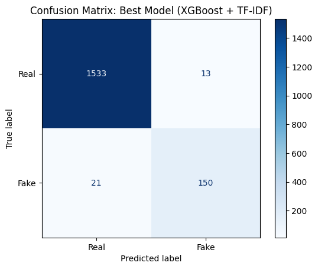

# 💼 Fraud Job Detection

A machine learning implementation that classifies job postings as real or fake, providing insights into fraudulent listings and protecting job seekers from scams. The model leverages natural language processing techniques to detect patterns in job postings—such as descriptions, requirements, benefits, and company profiles—ensuring a safer and more trustworthy job search experience.


## 📑 Table of Contents
  <ol>
    <li><a href="#introduction">Introduction</a></li>
    <li><a href="#demo">Demo</a></li>
    <li><a href="#features">Features</a></li>
    <li><a href="#dataset">Dataset</a></li>
    <li><a href="#model-approach">Model / Approach</a></li>
    <li><a href="#installation-setup">Installation / Setup</a></li>
    <li><a href="#usage">Usage</a></li>
    <li><a href="#results">Results</a></li>
    <li><a href="#project-structure">Project Structure</a></li>
    <li><a href="#acknowledgments">Acknowledgments</a></li>
  </ol>


## Introduction

Identifying fraudulent job postings is essential to protect job seekers and maintain trust in online job platforms.

This project provides a **fraud job detection classifier** that distinguishes between real and fake job listings, helping uncover scams and suspicious postings.

By leveraging natural language processing techniques, the project analyzes various aspects of job postings—such as descriptions, requirements, benefits, and company profiles—to reveal patterns associated with fraudulent listings, enabling safer and more reliable job search experiences.


## Demo

* **Exploration & Preprocessing**

  * [Data Cleaning & Exploration Notebook](https://github.com/karisazi/fraud-job-detection/blob/master/notebooks/01_initial/data_cleaning_exploration.ipynb)
  * [Preprocessing & Initial Modeling Notebook](https://github.com/karisazi/fraud-job-detection/blob/master/notebooks/01_initial/preprocessing_and_initial_modelling.ipynb)

* **Data Optimization & Augmentation**

  * [Back Translation Notebook](https://github.com/karisazi/fraud-job-detection/blob/master/notebooks/02_data_optimization/back_translation.ipynb)
  * [Reduce Majority Classes Notebook](https://github.com/karisazi/fraud-job-detection/blob/master/notebooks/02_data_optimization/reduce_majority_classes.ipynb)

* **Modeling Experiments**

  * [BERT Transformer Notebook](https://github.com/karisazi/fraud-job-detection/blob/master/notebooks/03_modelling/bert_transformer.ipynb)
  * [Undersampling + Augmented TF-IDF Notebook](https://github.com/karisazi/fraud-job-detection/blob/master/notebooks/03_modelling/undersampling_augmented_tfidf.ipynb)
  * [Undersampling TF-IDF Notebook](https://github.com/karisazi/fraud-job-detection/blob/master/notebooks/03_modelling/undersampling_tfidf.ipynb)

* **Final Model**

  * [Final Model Notebook](https://github.com/karisazi/fraud-job-detection/blob/master/notebooks/04_final/final_model.ipynb)


## Features

* **Detects fraudulent job postings** by classifying listings as **real or fake**.
* **Handles imbalanced datasets** effectively, ensuring reliable performance even when fake listings are a minority.
* **Leverages NLP techniques** such as TF-IDF and transformer embeddings for feature extraction.
* **Improves model performance** on minority (fraud) class using undersampling and data augmentation strategies.


## Dataset

* **Source:** [Real / Fake Job Posting Prediction](https://www.kaggle.com/datasets/shivamb/real-or-fake-fake-jobposting-prediction)
* **Format:** CSV file containing job posting information (e.g., title, description, requirements, benefits, company profile) and corresponding labels (**real** or **fake**).


## Model / Approach

* **Type**: Job Posting Fraud Detection
* **Components**:

  * **Features**: TF-IDF vectorization of job posting text, transformer embeddings for semantic similarity.
  * **Model**: XGBoost classifier and transformer-based models for comparison.
  * **Analysis**: Identification of key patterns in job postings contributing to real or fake labels.
* **Techniques**:

  * Data preprocessing, tokenization, text cleaning, and handling imbalanced datasets (undersampling & back translation).
  * Train-test split and cross-validation for robust evaluation.
* **Performance**:

  * Achieved **high F1-score on the minority (fake) class**, balancing overall accuracy.
  * Provides insights into **patterns indicative of fraudulent job postings**, helping job seekers avoid scams.


## Installation / Setup

### Prerequisites

* Python 3.10 or 3.11

### Steps

```bash
git clone https://github.com/karisazi/fraud-job-posting-detection.git
cd fraud-job-posting-detection
pip install -r requirements.txt
```

## Usage
### Run Jupyter Notebook
```bash
jupyter notebook
```
* This will open Jupyter in your default browser.
* Navigate to the notebook file you want to run and start executing cells.


## Results

| Class | Precision | Recall | F1-Score |
| ----- | --------- | ------ | -------- |
| Real  | 0.99      | 0.99   | 0.99     |
| Fake  | 0.92      | 0.88   | 0.90     |

**Confusion Matrix**

  


## Project Structure

```
job_posting_classifier/
│── data/                                # Raw & processed datasets
│   ├── fake_job_postings.csv             # Original dataset
│   ├── interim/                          # Intermediate/cleaned data
│   │   └── cleaned_fake_job_dataset.csv
│   └── processed/                        # Final datasets ready for modeling
│       ├── back_translation/             # Data augmented via back translation
│       ├── preprocessed_job_dataset.csv  # Encoded & preprocessed dataset
│       └── undersampling_no_similar_data # Dataset after undersampling
│
│── notebooks/                            # Jupyter Notebooks (exploration & experiments)
│   ├── 01_initial/                       # Initial cleaning & preprocessing
│   │   ├── data_cleaning_exploration.ipynb
│   │   └── preprocessing_and_initial_modelling.ipynb
│   ├── 02_data_optimization/             # Data augmentation & optimization
│   │   ├── back_translation.ipynb
│   │   └── reduce_majority_classes.ipynb
│   ├── 03_modelling/                     # Model training & experiments
│   │   ├── bert_transformer.ipynb
│   │   ├── undersampling_augmented_tfidf.ipynb
│   │   └── undersampling_tfidf.ipynb
│   └── 04_final/                        # Final model & evaluation
│       └── final_model.ipynb
│
│── requirements.txt       # Python dependencies
│── README.md              # Project description & usage


```

## Acknowledgments

* Dataset sourced from Kaggle: [Real / Fake Job Posting Prediction](https://www.kaggle.com/datasets/shivamb/real-or-fake-fake-jobposting-prediction).


